# Informatikprojekt-3-Nele-und-Marit
## Stundenübersicht des Informatikunterichts

[15/02/18, 1. Stunde](#1)

[16/02/18, 2. und 3. Stunde](#2)

[22/02/18, 4. Stunde](#3)

[23/02/18, 5. und 6. Stunde](#4)

[01/03/18, 7. Stunde](#5)

[02/03/18, 8. und 9. Stunde](#6)

## Erste Stunde

Wir haben  unser zweites Projekt abgegeben. Als drittes Projekt werden wir nun mit der Starlogo TNG Lernaktivität dort weitermachen, wo wir in der letzten Lernaktivität aufgehört haben. 

In unseren letzten Projekt haben wir mit der siebten Lernaktivität abgeschlossen: Wir haben ein Egoshooter-Spiel programmiert, in dem ein steuerbarer Luigi mit Paintbällen auf Giraffen schießt. Wird eine Giraffe getroffen, so färbt sie sich rot. Außerdem gibt es Löwen, welche sich zufällig im Spaceland bewegen. Trifft Luigi auf einen Löwen, so wird er gefressen, und das Spiel ist vorbei.

### Lernaktivität acht:

Wir haben unser Spiel zunächst so ergänzt, dass die Giraffen und Löwen verschwinden, wenn Luigi von einem Löwen gefressen worden ist.
Hierzu haben wir die globale Variable "Luigi Tot" eingeführt. Im "setup"-Bereich setzten wir diese zuerst auf "false". Im "collisions"-Bereich programmierten wir nun, dass die Variable als "true" wiedergegeben wird, wenn Luigi mit einem Löwen zusammengestoßen ist.
Dann fügten wir im "forever"-Bereich "if-test-then"-Blöcke hinzugefügt, und Die Paintbälle, Löwen und Giraffen sterben lassen, wenn "Luigi Tot" als "true" wiedergegeben wird.

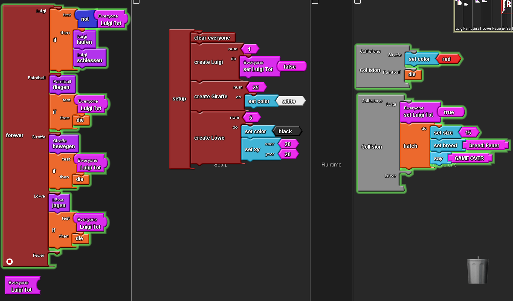

## Zweite und dritte Stunde

Zunächst haben wir den Stundenblog der letzten Stunde ergänzt.

Dann haben wir begonnen, die erste vorgegebene Aufgabe der achten Lernaktivität umzusetzen. Mit dem "Edit Terrain" Tool haben wir Wände im Spaceland erstellt, indem wir die Höhe einzelner Partien des Spacelands erhöht haben. Damit diese Wände auffälliger sind haben wir sie mit dem "drawing" Tool weiß angemalt. Wir fühlten uns in unsere Kindergartenzeit zurückversetzt, als wir merkten, wie nervenaufreibend es ist, ständig "überzumalen" und diese Fehler dann wieder verbessern zu müssen.

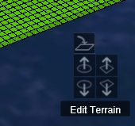

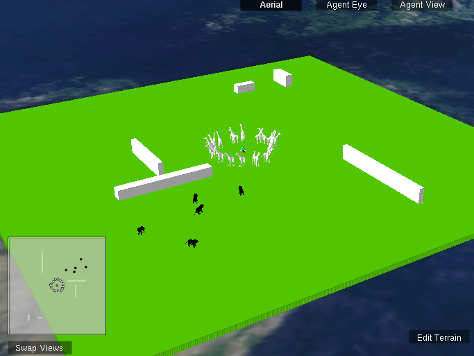

## Vierte Stunde

Wir begannen die Stunde damit, Luigi, die Paintbälle und die Tiere so zu programmieren, dass sie nicht mehr durch die Wände durchlaufen. Hierzu haben wir in den jeweiligen Methoden "if-test-then"-Blöcke benutzt: Mit dem Block "Wall ahead?" ließen wir testen, ob der jeweilige actor gegen eine Wand läuft. Für den Fall, dass er dies tut, haben wir die Paintbälle verschwinden lassen, Luigi um 90°, und die Giraffen und Löwen um 180° drehen lassen.  

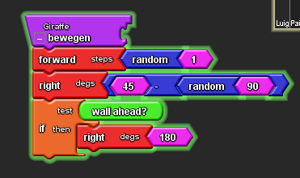

Wir beschlossen mit dieser Änderung die Lernaktivität acht abzuschließen und begannen mit Lernaktivität neun.

### Lernaktivität neun

Die Aufgabe dieser Lernaktivität besteht daraus, eine Epidemie zu programmieren. Hierzu erstellten wir zunächst die Rasse der gesunden Bären. Wir programmierten einen slider, mit dem man die Anzahl der Bären einstellen kann, und dass diese blau gefärbt sind. Außerdem programmierten wir die Prozedur "bewegen", nach der die gesunden Bären sich willkürlich bewegen.

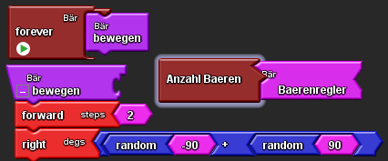
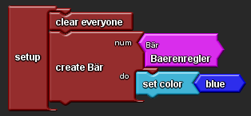

## Fünfte und sechste Stunde

Wir begannen die Stunde damit, eine zweite Bärenart zu erstellen. Diese nannten wir "Bär krank". Auch für die kranken Bären erstellten wir einen Slider, mit dessen sich die Anzahl der erstellten Bären regulieren lässt. Die kranken Bären färbten wir rot, und ließen sie sich auf die gleiche Art und Weise zufällig bewegen, wie die gesunden Bären.

Für die Ansteckung benutzten wir einen Kollisionsblock. Mit einem Random-Block und einem neuen Slider programmierten wir eine einstellbare Wahrscheinlichkeit für eine Ansteckung. Stckt der gesunde Bär sich an, so wird er zu einem kranken Bären. Hierzu benutzten wir einen "setBreed"- und einen "setColor"-Block:

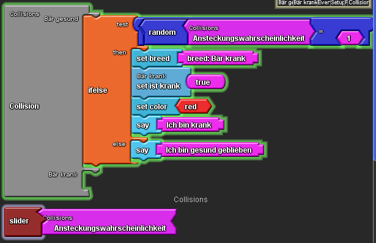

Um zu überprüfen, ob unser Slider funtioniert, haben wir die Bären nach einer Kollision mit Hilfe zweier "say"-Blöcke entweder "Ich bin krank", oder Ich bin gesund geblieben" sagen lassen:

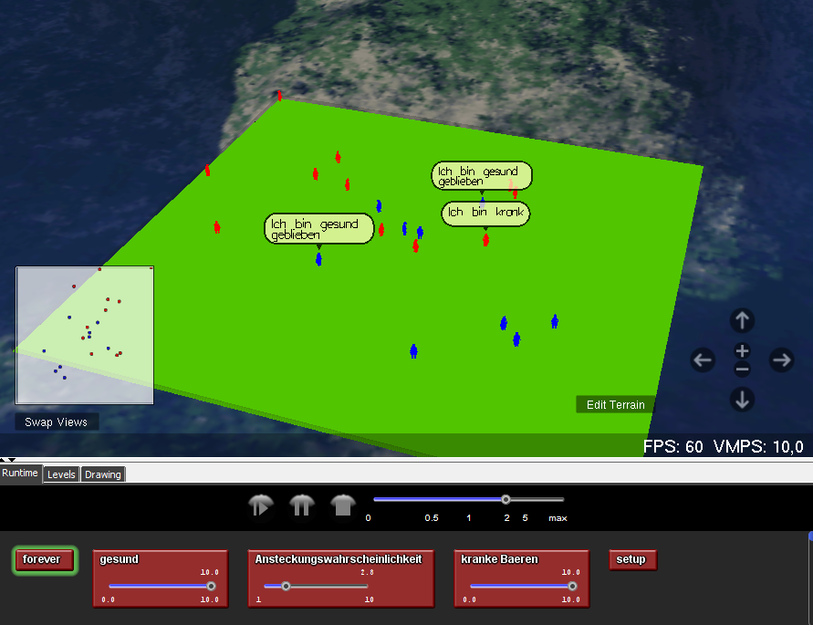
(Auf dem Screenshot liegt die Wahrscheinlichkeit für eine Ansteckung bei ungefähr 50%.)

Auf Herrn Buhls Hinweis hin werden wir in der nächsten Stunde unser Programm dahingehend verändern, dass es nur noch einen Bärenrasse gibt, und das Kranksein zu einer Eigenschaft dieser wir, die ein Bäre entweder haben, oder nicht haben kann.
Außerdem werden wir danach versuchen, einen räumlichen Krankheitsherd einzurichten. Die gesunden Bären sollen sich dann anstecken, wenn sie den Bereich betreten.

## Siebte Stunde

Wir haben zunächst eine der Bärenrassen gelöscht und die Eigenschaft "ist krank" für Bären erstellt. Dann veränderten wir den Setup-Bereich so, dass von der Gesamtzahl der Bären ein gewisser Prozentsatz von Anfang an krank ist. Dieser Prozentsatz lässt sich mit einem Slider einstellen.

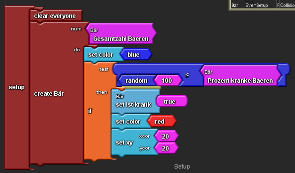

Anschließend veränderten wir auch unseren Collisions-Bereich so, dass es nicht ,mehr die Kollision zwischen den zwei verschieden Bärenarten gibt, sondern nur eine zwischen zwei Bären der einzigen vorhandenen Rasse. Wir benutzten einen "if-test-then"-Block, der testet, ob einer der Bären krank ist. Wenn dies der Fall ist, wird der gesunde Bär mit einer einstellbaren Wahrscheinlichkeit ebenfalls krank.

## Achte und neunte Stunde

Zuerst vervollständigten wir den Stundenblog der gestrigen Stunde. 

Dann behoben wir einen Fehler, der dafür gesorgt hatte, dass bereits am Anfang alle Bären krank waren: Wir hatten vergessen, die Eigenschaft "ist krank" im setup-Bereich als falsch zu initialisieren.

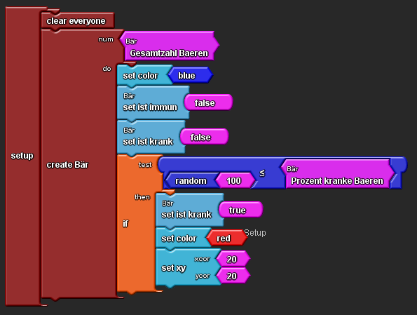

Dies holten wir nun nach. Außerdem initialisierten wir auch die Eigenschaft "ist immun" als falsch und fügten "ist nicht immun" als Testbedingung für eine Ansteckung im Collisions-Bereich hinzu.

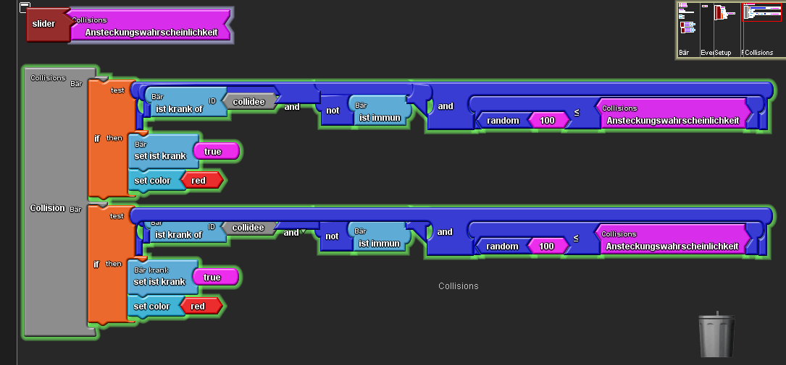

Nun funktioniert die Epidemie und man kann einstellen, wie viele Bären es insgesamt gibt, und wie viele von ihnen von Anfang an krank sind. Auch die Ansteckungswahrscheinlichkeit lässt sich mit einem Slider einstellen.

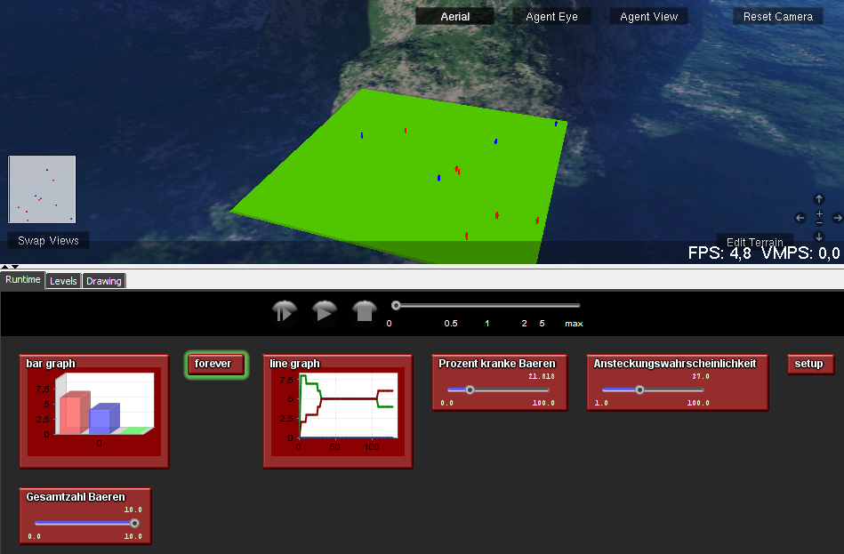

Nun programmierten wir die Immunität. Hierzu erstellten wir einen weiteren Slider, der die Genesungswahrscheinlichkeit einstellt. Wir ergänzten unseren "collision"-Block, indem wir den "if-test-then"-Block durch einen "if-test-then-else"-Block austauschten. unter "else" fügten wir dann einen weiteren "if-test-then"-Block hinzu. Dieser testet die Genesungswahrscheinlichkeit, und setzt für einen einstellbaren Prozentsatz der kollidierenden bereits kranken Bären die Eigenschaft "ist krank" auf falsch und die Eigenschaft "ist immun" auf wahr. Nun ist es möglich, dass kranke Bären, wenn sie miteinander kollidieren wieder gesund werden und dann immun sind. Diese immunen Bären sind dann grün.

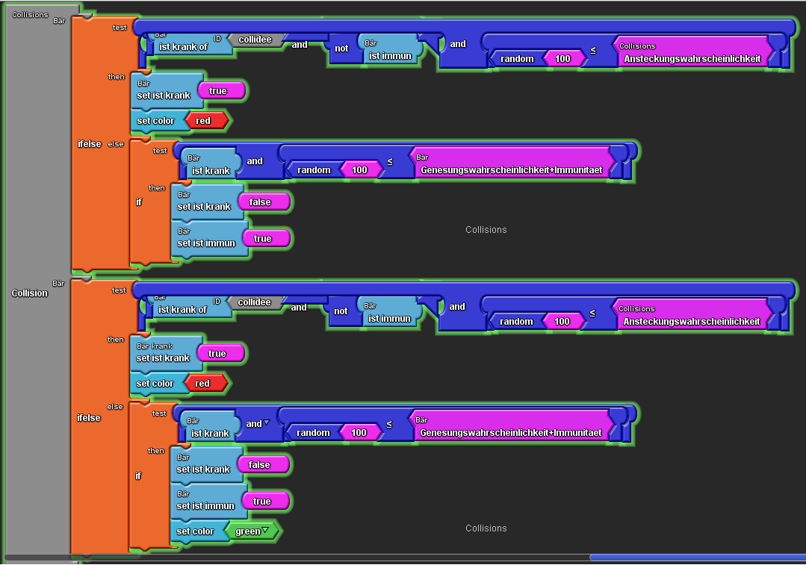
